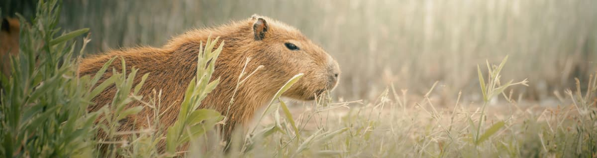

<picture>
 
</picture>

## About me

<!-- TO DO: add more details about me later -->
Hi, I'm Algacyr. Future DevOps Engineer — automating workflows and breaking things (safely)

My top languages

| Rank | Languages |
|-----:|-----------|
|     1| Python    |
|     2| Bash      |
|     3| C         |

---
> Calm as a capybara, efficient as Python.
